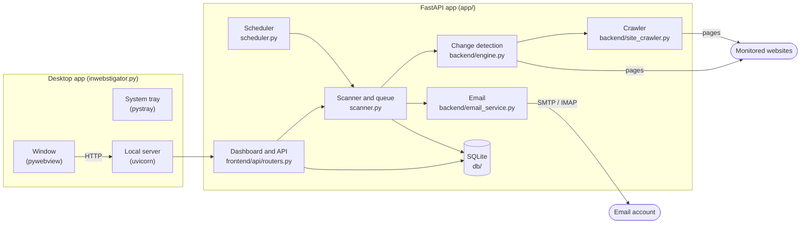
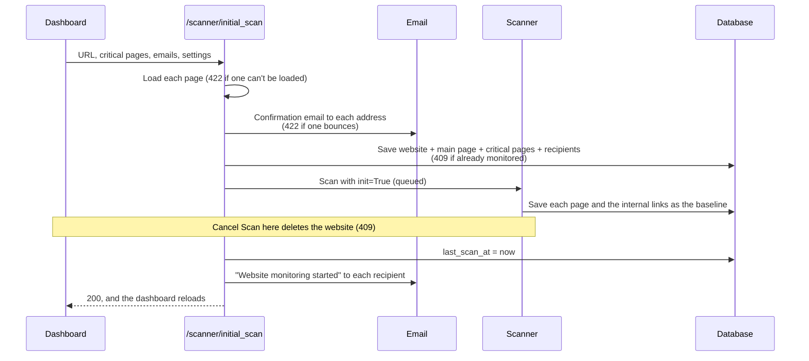
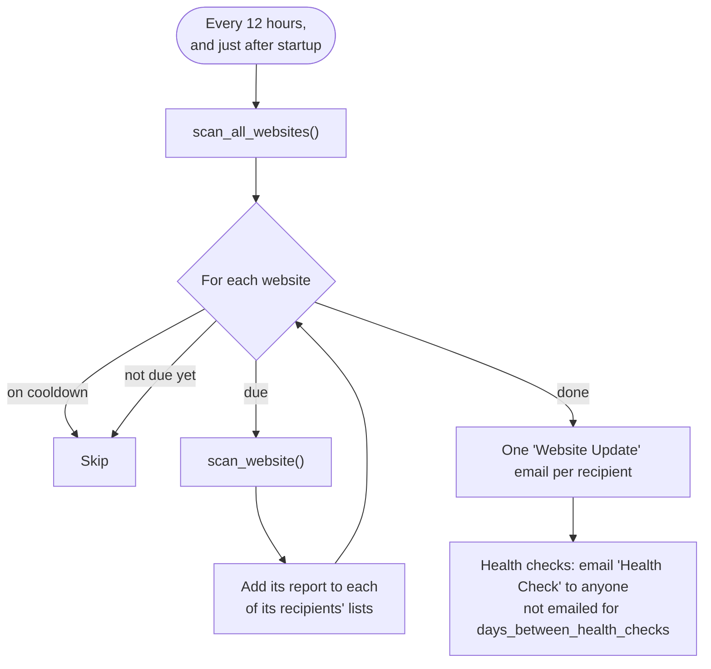
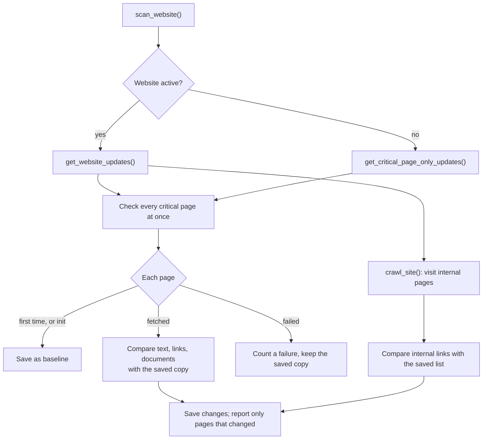
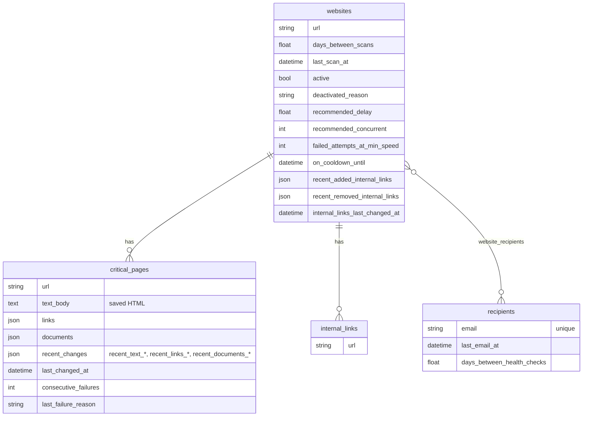

# Architecture

How Inwebstigator works, for developers changing it. For setting up and running
the project, see the [README](../README.md).

**Contents:** [Overview](#overview) · [The desktop app](#the-desktop-app) ·
[The dashboard](#the-dashboard) · [Adding a website](#adding-a-website) ·
[Scheduling](#scheduling) · [The scan queue](#the-scan-queue) ·
[Scanning a website](#scanning-a-website) · [Change detection](#change-detection) ·
[When websites struggle](#when-websites-struggle) · [Emails](#emails) ·
[Data model](#data-model) · [Where to change things](#where-to-change-things)

---

## Overview

Everything runs in one process on the user's computer. The dashboard is
server-rendered HTML with a little JavaScript, served by FastAPI. Scans run
inside the same process, on its event loop, so there's no separate worker or
message queue.

---

## The desktop app

`inwebstigator.py` turns the web app into a Windows desktop app:

| Thread | What it does |
| --- | --- |
| Main | Runs the pywebview window. It shows a "Starting Inwebstigator" page, then loads the dashboard once the server is ready. |
| `uvicorn` | Runs the FastAPI app on `127.0.0.1`, on port 48731 if free, otherwise any free port. |
| `system-tray` | The tray icon, with **Open**, **Hide** and **Quit**. |

- **Closing the window** only hides it, so scans carry on. **Quit** (or
  `Ctrl+C` in the console) stops the server and exits.
- **A Windows mutex** stops a second copy starting. The second copy shows a
  message and exits.
- **The window keeps its browser storage** in `<data dir>/webview` and uses a
  fixed port where possible, so things like the chosen theme are remembered
  between launches.

The data directory is `<home>/AppData/Local/inwebstigator`, which holds the
database and the window's storage. It's outside the app's own folder, so a new
version can be unzipped over an old one.

---

## The dashboard

`GET /` renders `frontend/templates/index.html` (Jinja2). The page has two tabs:

- **Websites:** a card per website, plus the Add Website wizard.
- **Updates:** the recent changes, grouped by website, then by critical page.

The route builds everything the template needs: each website, its display
name, and its changes as `WebsiteDailyRecord` objects (`frontend/api/utils.py`).
Changed text is turned into highlighted word-by-word HTML by `build_word_diff()`,
which escapes everything it wraps.

The header (`_header.html`), footer (`_footer.html`) and `<head>`
(`_head.html`) are shared with the About page (`about.html`), as is
`static/theme.js`, the light and dark toggle. The rest of the dashboard's
JavaScript is inline in `index.html`, apart from `static/email-suggestions.js`.

After an action (adding, deleting, saving settings, finishing a scan) the
dashboard usually just reloads. The open tab is kept in the URL (`#updates`)
and open cards in `sessionStorage`, so a reload doesn't lose your place. The
chosen theme and "Don't show again" on the background scan note are kept in
`localStorage`, which the desktop window keeps between launches.

**Display names** come from `website_name()`. It uses the site name or title
saved on the website's main page if it can match it to the domain, otherwise
a cleaned-up domain (e.g. `uwa.edu.au` → "Uwa"), plus any path (e.g. "Uwa - News").

### Routes

| Route | What it does |
| --- | --- |
| `GET /` | The dashboard. |
| `GET /about` | The About page: what the app does, the team and copyright. |
| `POST /scanner/initial_scan` | Adds a website and runs its first scan. See [Adding a website](#adding-a-website). |
| `POST /scanner/initial_critical_page_scan` | Adds a critical page to a website and saves its first copy. |
| `POST /scanner/run` | Scans one website now (**Run scan**). Emails "Manual Website Scan" if anything changed. |
| `POST /scanner/run_all` | Scans every website now, ignoring their schedules (**Run All Scans**), and restarts the scheduler's countdown. |
| `POST /scanner/cancel_all` | Cancels a running **Run All Scans**: the website being scanned is cancelled and the rest skipped. Websites already scanned keep their results. |
| `POST /scanner/cancel` | Cancels a website's queued or running scan. |
| `/websites`, `/critical_pages`, `/recipients` | Create, read, update and delete, from `create_crud_router()`. Updating a website confirms any added emails first. Deleting one cancels its scan. |

FastAPI's own API docs are at `/docs`.

---

## Adding a website

The website's own URL is always saved as a critical page ("Main website
(automatic)"). The first scan runs with `init=True`. It saves each page's
current HTML, links and documents, and the site's internal links, as the
baseline, and reports nothing. Later scans compare against that.

---

## Scheduling

`scheduler.py` uses APScheduler, started from FastAPI's lifespan, and only if
`AUTOMATIC_SCANS` is on. One job runs a second after startup, then every
`SCHEDULER_MINIMUM_DAYS_BETWEEN_SCANS` (12 hours):

- **When a website is due:** once `days_between_scans` have passed since the
  *start of the day* it was last scanned. Counting from the start of the day
  stops scans drifting later each day, as a run takes time.
- **Health checks** work the same way, from the start of the day the
  recipient was last emailed. Any email counts, including "Website monitoring
  started", so a new recipient gets their first one about a week later.
- **A run carries on after a failure.** A website that fails is logged and
  skipped, and so is a failed email.

---

## The scan queue

Scans run **one at a time**, in the order they were asked for, whether from
the scheduler, **Run scan**, **Run All Scans** or adding a website.

- `scanner.queued_crawl()` wraps each website's crawl in its own `asyncio`
  task, and waits for `scan_lock` before running it.
- `queued_crawls` maps each queued or running website URL to its task. Asking
  to scan a website already in it raises `ScanAlreadyQueuedError` (409).
- `cancel_scan(url)` cancels that task, whether it's waiting or running. The
  request waiting for it gets `ScanCancelledError` (409), and nothing from the
  cancelled scan is saved.

The dashboard reads `queued_crawls` when it renders, so after a reload a card
still shows "Scan queued or running…".

---

## Scanning a website

`scanner.scan_website()` → `scanner._check_for_updates()` → `backend/engine.py`:

- **Critical pages are checked in parallel**, and failures are caught per page,
  so one broken page doesn't stop the rest. A failed page keeps its saved copy
  and its `consecutive_failures` goes up. After
  `CRITICAL_PAGE_ALERT_AFTER_FAILURES` (2) in a row it's listed in the report.
  A 404 or 410 is reported straight away. A page that works again has its count
  reset.
- **The crawl** (`site_crawler.crawl_site()`) visits pages in batches, up to
  `concurrent` at a time, waiting `delay` seconds before each request. It
  follows only links on the same website and under the website's path,
  treating `example.com` and `www.example.com` as the same. A redirect off the
  website is skipped.
- **A website's first crawl** (or one with no saved internal links) just saves
  them. After that, added and removed internal links are reported.
- **Only pages changed by this scan go in its report.** A page's recent changes
  stay saved (and on the dashboard) until it changes again, but they aren't
  emailed again.
- **Inactive websites** only have their critical pages checked. That's what
  "inactive" means, and it's why a too-large website is made inactive rather
  than dropped.

---

## Change detection

Comparing a critical page's saved copy with the new one:

1. **Reading the page** (`backend/utils/html_parser.py`). The page is cleaned
   (scripts, styles, comments and text that looks like HTML tags are removed).
   Then, inside `<main>` (or `<body>`) but outside `<nav>` and `<aside>`, it's
   turned into a list of text **blocks**: paragraphs, list items, quotes and
   table rows. Each block remembers the heading it sits under. A block nested
   in another is part of the outer one, so text isn't counted twice.
2. **Comparing blocks** (`backend/diff_checker.py`). Python's `SequenceMatcher`
   lines the two lists of blocks up. Matching blocks are unchanged. In a
   stretch that differs, blocks are paired up when their text is at least
   `DIFF_CHECKER_TEXT_SIMILARITY_THRESHOLD` (60%) similar: these are **changed**.
   The rest are **added** or **removed**. Each block is compared with at most
   `DIFF_CHECKER_MAX_COMPARISONS_PER_BLOCK` others, to keep big pages quick.
3. **Links and documents** are compared as sets: anything new is added and
   anything gone is removed. A link to a file such as a PDF or Word document
   counts as a document.

The results are saved on the page as `recent_text_added`, `recent_text_removed`,
`recent_text_changed`, `recent_links_*` and `recent_documents_*`, with
`last_changed_at`. The new HTML replaces `text_body` only when something
changed.

---

## When websites struggle

| What happens | How it's detected | What the app does |
| --- | --- | --- |
| Rate limited or overloaded | HTTP 429, 502, 503 or 504 after retries, or 50 or more 403s in one crawl batch (one round of the crawl's queue) | Slows the website down (delay +0.5s up to 3s, concurrency halved down to 1) and pauses it for 24 hours. Once it's already at the slowest speed, each further time is counted, and after 3 the website is made **inactive**. |
| Unreachable | Connection error or timeout after retries | Pauses it for 2 hours. |
| Too large | More than 50,000 pages found | Made **inactive** with the reason `too_large`, then its critical pages are checked straight away. |

Paused websites (`on_cooldown_until`) are skipped by scheduled runs and **Run
All Scans**. Page fetches are retried with exponential backoff (5 attempts) by
`backend/utils/http_client.py` before any of this happens. Each problem also
goes in the scan's report, so recipients hear about it.

---

## Emails

`backend/email_service.py` sends over SMTP with SSL, retrying temporary
failures (3 attempts, exponential backoff). Permanent errors, like a failed
login or a refused address, fail straight away. The HTML comes from
`backend/format_message.py`.

| Email | Sent by | To |
| --- | --- | --- |
| Email address added to website monitoring | Adding an address | That address |
| Website monitoring started | `send_monitoring_started_notifications()` after the first scan | The website's recipients |
| Website Update | A scheduled run or **Run All Scans** | Each recipient, one email for all their websites |
| Manual Website Scan | **Run scan** | The website's recipients |
| Health Check | The scheduler | Anyone not emailed for `days_between_health_checks` days |

Every successful send updates the recipient's `last_email_at`, which is what
health checks count from.

**Checking an address can receive email.** Mail servers accept an email first
and report a missing mailbox later, by sending a bounce back to the sender. So
`confirm_address_can_receive_email()` counts the bounces about the address in
the sending account's inbox (over IMAP), sends the confirmation, then checks
the inbox every 3 seconds for up to 30 seconds for a new one. The inbox is
`IMAP_HOST`, or `SMTP_HOST` with `smtp.` swapped for `imap.`. If it can't be
opened, the confirmation is just sent. Addresses that are already recipients are emailed
without waiting.

---

## Data model

- **Uniqueness:** recipients' emails are unique. A critical page's URL and an
  internal link's URL are unique **within their website**, so overlapping
  websites (e.g. `uwa.edu.au` and `uwa.edu.au/news`) can share pages. Adding a
  website that's already monitored is refused in `WebsiteService.create()`,
  however its address is written (`same_page_key()` ignores `www.`, `http` vs
  `https` and a trailing `/`).
- **Deleting** a website deletes its critical pages and internal links.
  Recipients are shared between websites, so they're only unlinked.
- **Database access** goes through `db/services/` (one service per table, with
  the same create, read, update and delete methods) and `db/repository.py`.
  Request handlers get a session from `get_db_session()`, which commits at the
  end of the request. Background work uses `db_context()`.
- **Upgrades:** see [Database in the README](../README.md#database).

---

## Where to change things

| To change… | Look at |
| --- | --- |
| What's shown on the dashboard | `frontend/templates/index.html`, `static/style.css`, and the `get_dashboard()` route |
| What counts as a text change | `backend/utils/html_parser.py`, `backend/diff_checker.py` |
| Which pages the crawler visits | `backend/site_crawler.py`, `backend/utils/links.py` |
| What's emailed and when | `scanner.py` (reports), `scheduler.py` (health checks), `backend/format_message.py` (wording) |
| How a struggling website is handled | `WebsiteService.handle_*()` in `db/services/website_service.py` |
| Defaults and limits | `core/config.py` |
| The database | `db/schema.py`, plus an upgrade step in `db/migrations.py` if existing databases need changing |
